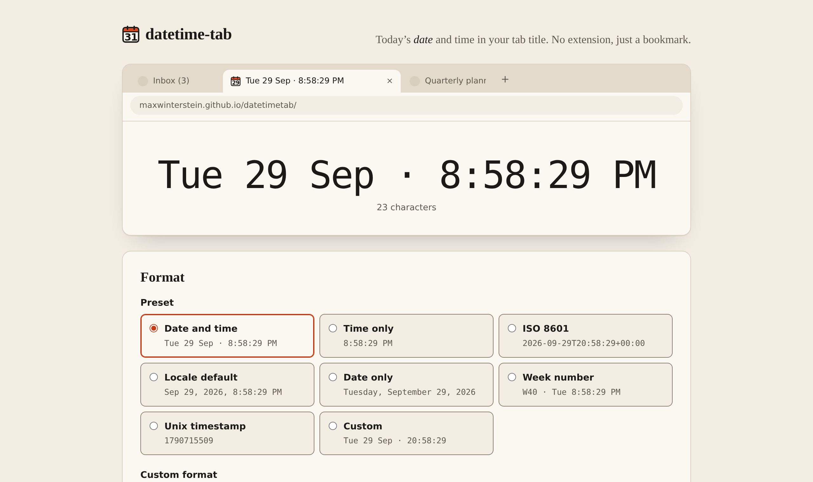

# datetime-tab

Today's **date** and time in your browser **tab title**, live, in whatever
format you like. **No extension, just a bookmark.**

Clock websites put only the time in the tab title; the few tools that show the
date too are browser extensions. datetime-tab is a plain web page: pick a
format, and the link carries it, so a bookmark or pinned tab is the whole
setup, and you can send it to someone else. Pinned tabs hide the title, so
the tab icon shows today's date as well.

### → [maxwinterstein.github.io/datetimetab](https://maxwinterstein.github.io/datetimetab/)

<picture>
  <source media="(prefers-color-scheme: dark)" srcset=".github/screenshot-dark.png">
  
</picture>

A single static page: no framework, no build step, no tracking, no cookies,
no ads. Your settings stay in your browser. Install it as an app and it works
offline.

## Features

- **Live tab title** — `document.title` updates on each second boundary (or
  each minute, if your format has no seconds), so it does not drift.
- **Presets or your own format** — weekday clock, time only, ISO 8601, locale
  default, date only, week number, Unix timestamp; or write a pattern with
  tokens (`HH:mm:ss`, `ddd D MMM`, …). The page shows a large live preview and
  a mock tab strip, so you can see where a long title gets cut off.
- **Language, time zone, 12/24 h, seconds, prefix/suffix** — all adjustable.
- **A calendar-page favicon** showing today's day of the month (in the chosen
  time zone), so even a pinned tab with no title text still shows the date.
- **Remembers your choice** in `localStorage` and can be **shared as a link**
  (*Copy link*); *Reset* returns to the defaults.
- **Works offline and installs as an app** — a small service worker
  (`web/sw.js`) keeps a copy of the page, so bookmarks and pinned tabs load
  without a network. It is network-first: online you always get the latest
  deploy, the cache is only the fallback. Your browser's *Install* option
  gives datetime-tab a window of its own.

### Format tokens

| token                 | example                    | token               | example           |
| --------------------- | -------------------------- | ------------------- | ----------------- |
| `YYYY` `YY`           | `2026` `26`                | `HH` `H`            | `09` `9` (24 h)   |
| `MMMM` `MMM` `MM` `M` | `September` `Sep` `09` `9` | `hh` `h`            | `09` `9` (12 h)   |
| `DD` `D`              | `05` `5`                   | `mm` `ss`           | minutes, seconds  |
| `dddd` `ddd`          | `Tuesday` `Tue`            | `A` `a`             | `PM` `pm`         |
| `W` `WW` `GGGG`       | ISO week, week-year        | `Z` `ZZ` `z`        | offset, zone name |
| `X`                   | Unix seconds               | `L` `LL` `LT` `LTS` | locale formats    |

Anything else in `[brackets]` is printed literally. **Wrap plain words in
brackets**, e.g. `HH:mm [Uhr]` — otherwise letters like `h` or `a` are read as
tokens. The page lists every token with a live example.

## URL parameters

<!-- Keep in sync with parseSettings() in web/format.js. -->

| parameter | values                                                      | example               |
| --------- | ----------------------------------------------------------- | --------------------- |
| `preset`  | `clock` `time` `iso` `locale` `date` `week` `unix` `custom` | `?preset=iso`         |
| `format`  | a token pattern (implies `preset=custom` if no `preset`)    | `?format=HH:mm+[Uhr]` |
| `locale`  | a BCP 47 language tag; empty = browser default              | `?locale=de-DE`       |
| `tz`      | an IANA time zone; empty = your own                         | `?tz=Asia/Tokyo`      |
| `clock`   | `auto` `12` `24`                                            | `?clock=24`           |
| `seconds` | `1` or `0` (also `true`/`false`, `yes`/`no`, `on`/`off`)   | `?seconds=0`          |
| `prefix`  | text before the time (up to 24 chars)                       | `?prefix=Berlin`      |
| `suffix`  | text after the time (up to 24 chars)                        | `?suffix=(UTC)`       |

Invalid values are ignored. If the URL carries any of these, it wins
*entirely* over your saved settings, so a shared link shows the same clock for
everyone who opens it. A bare URL uses what you saved last time. Opening a
link does not overwrite your saved settings; only changing something on the
page does.

## Background tabs

Browsers throttle timers in background tabs — Chrome batches them to once a
minute after five minutes hidden. datetime-tab therefore keeps its wake-up timer in
a small Web Worker (`web/tick-worker.js`), whose timers are not subject to that
throttling, and falls back to a normal timer where workers are unavailable. If
a browser still delays it, the page catches up as soon as the tab is visible
or focused again. Formats without seconds are unaffected in practice.

## Quick start

You need [Node 22+](https://nodejs.org), [go-task](https://taskfile.dev) and
[prek](https://github.com/j178/prek) (git hooks; `task check` runs them too,
and CI does). With [mise](https://mise.jdx.dev), `mise install` gets all
three at the pinned versions from `mise.toml`. Without prek, `task setup` and
`task check` warn and skip the hooks.

```sh
mise trust && mise install   # once: Node, task, prek (or install them yourself)
task setup    # npm install + git hooks
task serve    # http://localhost:8080 straight from web/ — edit, reload
```

### Remember these

| command          | what it does                                             |
| ---------------- | -------------------------------------------------------- |
| `task`           | list every task                                          |
| `task setup`     | install Biome and the git hooks (once per clone)         |
| `task serve`     | serve `web/` at <http://localhost:8080>                  |
| `task test`      | run the tests (`task test:watch` to keep them running)   |
| `task fmt`       | format everything and apply safe lint fixes              |
| `task check`     | **everything CI runs** — do this before you push         |
| `task web`       | build `dist/` and serve exactly what Pages will publish  |

If `task check` is green *with prek installed*, CI will be green. Without prek
the whitespace/YAML/JSON hooks are skipped locally but still run in CI.

## Development

```
web/          the site, served as-is — index.html, style.css, ES modules
  format.js   pure formatting logic, no DOM, imported by the tests
test/         node:test suites (*.test.mjs)
tools/        build-web.mjs (copy + link check), serve.mjs (zero-dep server)
```

- **No bundler, no framework.** The browser loads `web/` directly as ES
  modules. The only dev dependency is [Biome](https://biomejs.dev), for lint
  and formatting.
- **Tests** use Node's built-in runner: `node --test "test/*.test.mjs"`.
  Formatting logic lives in `web/format.js` precisely so it can be tested
  without a browser.
- **`task build`** copies `web/` to `dist/` and fails if any relative import,
  `src`, `href` or CSS `url()` points at a file that does not exist — a missing
  module would otherwise leave every check green and the deployed page dead.
- **Hooks** (prek, pre-commit compatible) run Biome and the tests on commit,
  plus whitespace/YAML/JSON hygiene. See `.pre-commit-config.yaml`.

See [AGENTS.md](AGENTS.md) for conventions.

## Dependency updates

[Renovate](https://docs.renovatebot.com) keeps everything current
(`renovate.json`), and merges non-major updates on its own once CI is green.
That is safe here for a reason that is easy to miss: **the page itself has no
dependencies at all.** Every update is to dev tooling, CI actions or the
vibepod overlay, and CI exercises all of them, including a full build of the
overlay. What keeps it honest:

- Branch protection on `main` requires both CI jobs (`check`, `overlay`) to
  pass on a branch that is **up to date with `main`**, so two updates can never
  merge on the strength of CI runs that never saw them together.
- A release must be **three days old** before Renovate proposes it; broken or
  compromised releases are usually pulled within that window.
- GitHub Actions are pinned to **commit SHAs** (a test enforces it).
- Versions that must match (Biome in `package.json` and `biome.jsonc`; task and
  prek in `mise.toml` and the overlay) are updated **in one PR**.
- **Major updates**, and any update to the three Pages deploy actions, which
  no pull request can exercise, wait for a human.

## Deployment

Every push to `main` runs CI (lint, tests, build, hooks). When CI succeeds, the
**Deploy to GitHub Pages** workflow builds `dist/` from that exact commit and
publishes it. A red CI never deploys.

One-time setup on GitHub: **Settings → Pages → Build and deployment → Source:
GitHub Actions.** Without it the deploy job fails with a 404 from the Pages API.

You can also trigger a deploy by hand from the Actions tab (*Deploy to GitHub
Pages → Run workflow*).

## Licence

MIT — see [LICENSE](LICENSE).
